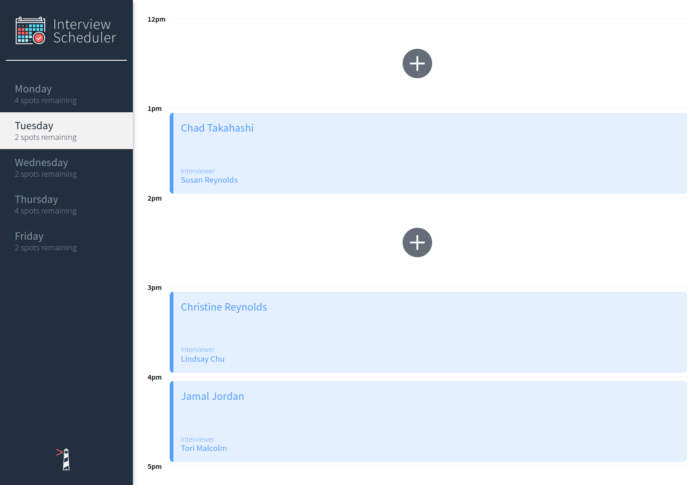
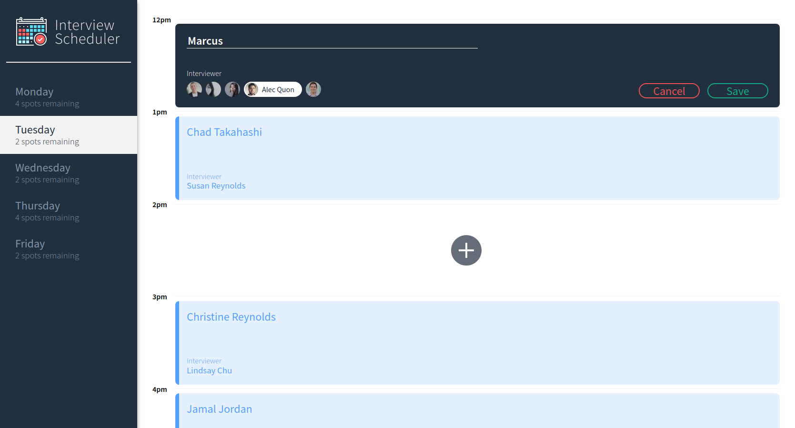
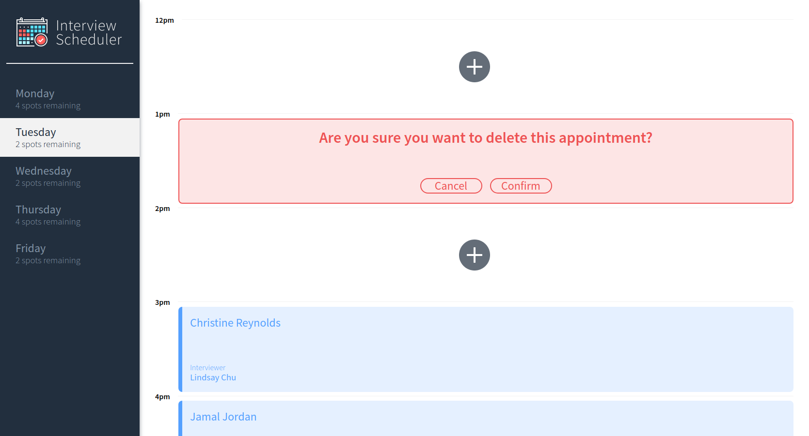

# Interview Scheduler

Interview Scheduler is a single page application (SPA) I built using React in order to learn the framework.  
Data is persisted by the API server using a PostgreSQL database.  
The client application communicates with an API server over HTTP, using the JSON format.  
Jest tests, Storybook and Cypress were used through the development of the project for testing.  

## Screenshots

### Home Page


### Adding / Editing Appointments


### Delete Appointments


## Setup

Install dependencies with `npm install`.

## Running Webpack Development Server

```sh
npm start
```

## Running Jest Test Framework

```sh
npm test
```

## Running Storybook Visual Testbed

```sh
npm run storybook
```

## Running Cypress End-to-End Tests

```sh
npm run cypress
```

## Future Todos

* Refactor useApplicationData to use a reducer for the state
* Deploy application to Heroku
